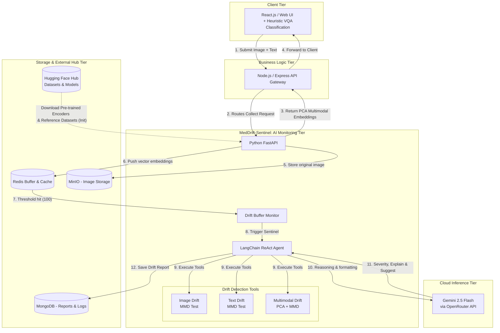
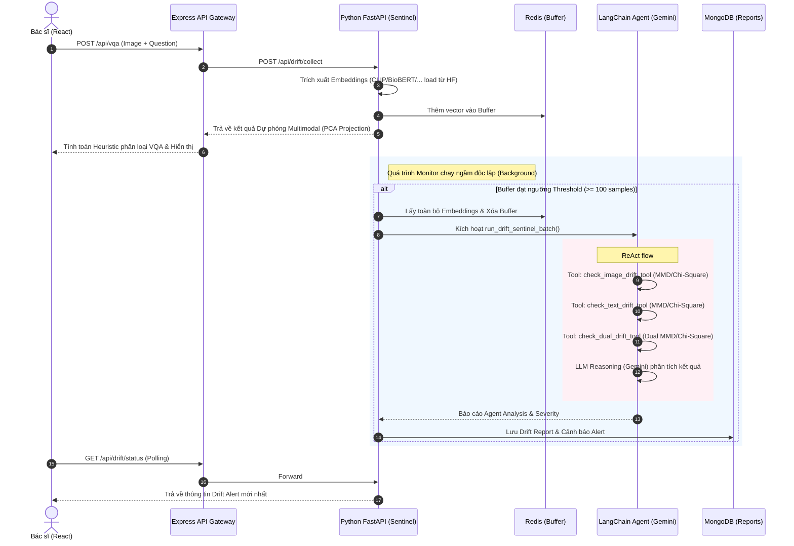
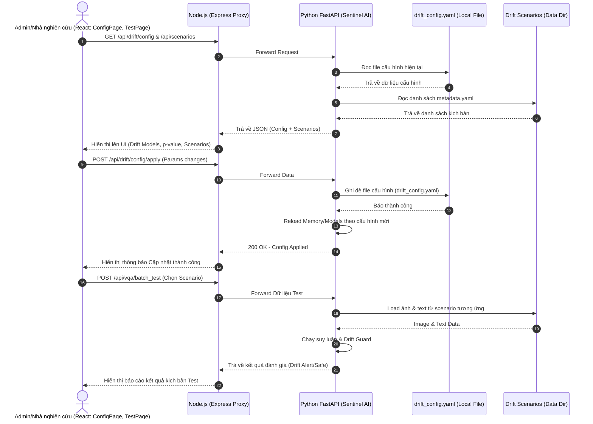
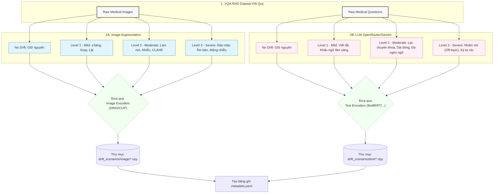

# Tổng quan Kiến trúc Hệ thống và Luồng dữ liệu (MedDrift-Sentinel)

Dựa trên cấu trúc dự án và mô tả luồng hoạt động, dưới đây là sơ đồ Tổng quan Kiến trúc Hệ thống và Luồng dữ liệu Sequence Diagram, được vẽ lại bằng Mermaid.

## 1. Sơ đồ Kiến trúc Hệ thống (System Architecture Diagram)

Sơ đồ này mô tả cách các thành phần trong hệ thống tương tác với nhau, tập trung vào kiến trúc Sentinel giám sát dựa trên LangChain ReAct Agent.

### Chi tiết vai trò của các tầng (Tiers):
1. **Client Tier**: Là giao diện tương tác người dùng xây dựng bằng React.js/Vite. Nơi bác sĩ gửi câu hỏi kèm hình ảnh. Tại đây, React sẽ sử dụng các vector chiếu (PCA) trả về để chạy thuật toán Linear Classification đơn giản ra đáp án VQA (Có/Không). Nơi này cũng hiển thị / giám sát biểu đồ PCA và cấu hình các kịch bản test Drift.
2. **Business Logic Tier**: Được vận hành bằng Node.js & Express.js đóng vai trò API Gateway, giúp định tuyến request xuống AI Monitoring và đảm bảo vấn đề CORS, Static path.
3. **Storage & External Hub Tier**: Lớp lưu trữ cơ sở dữ liệu và quản lý model:
   - **Hugging Face Hub**: Đóng vai trò là nguồn tải xuống Data Tham chiếu (Reference VQA-RAD) và các Models Encoders tiền huấn luyện (như DINOv2, BioBERT) được mount vào thư mục cache docker ở lần khởi chạy đầu tiên.
   - **Redis**: Dùng làm đệm (Buffer) để cache vector trích xuất. Khi số lượng kỷ lục đạt Threshold (ngưỡng 100 theo cấu hình), nó sẽ kích hoạt flush_buffer để chạy Agent.
   - **MongoDB**: Hệ quản trị phi quan hệ để lưu lịch sử, các kịch bản và toàn bộ các Drift Reports sau khi agent chạy xong.
   - **MinIO**: Object Storage lưu trữ ảnh nguyên bản do Client gửi lên để truy xuất hiển thị cho báo cáo và lưu dữ liệu offline generation.
4. **AI Monitoring Tier (MedDrift-Sentinel)**: Module AI cốt lõi xây dựng bởi Python FastAPI, chứa engine trích xuất vector embedding và đính kèm **LangChain ReAct Agent**. Tại đây, nó chiếu các vector đa phương thức (PCA) và xử lý giám sát kiểm định cho luồng batch data từ Redis bằng các Tools phân phối.
5. **Cloud Inference Tier**: Khác với các hệ thống phổ thông, ta không tốn chip xử lý cho LLM tại chỗ mà đẩy logic Suy luận qua đám mây:
   - *OpenRouter (Gemini)*: LLM Agent xử lý tự động trong luồng LangChain. Nhận Input kết quả báo cáo MMD thống kê, thực hiện quá trình Suy diễn (Reasoning), chỉ ra lý do hiện trạng Drift và đánh giá cấp độ cảnh báo (Severity).

---

## 2. Biểu đồ Tuần tự (Sequence Diagram)

Biểu đồ này biểu diễn chi tiết luồng dữ liệu (Data Flow) theo thời gian thực từ lúc Bác sĩ upload câu hỏi và hình ảnh, cho đến cách LangChain Sentinel hoạt động giám sát ngầm.

---

## 3. Luồng Quản lý Cấu hình và Kịch bản Test (Configuration & Scenario Testing Flow)

Ngoài luồng chính phục vụ chẩn đoán, hệ thống còn cung cấp giao diện quản trị (Configuration/Testing Flow). Tại đây, người dùng hệ thống hoặc admin có thể điều chỉnh cấu hình mạng nơ-ron, tham số thuật toán (p-value, test type) hay chọn kịch bản (scenario) test.

---

## 4. Hệ thống Tiền xử lý và Sinh Dữ liệu Reference & Drift (Data Pipeline)

Để hệ thống có thể đối chiếu và phát hiện Drift, kiến trúc dự án có một luồng chuẩn bị dữ liệu ngoại tuyến (Offline Data Preparation), thực hiện qua các script Python tại `meddrift-ai-service/scripts/`. Quá trình này bao gồm 2 nhiệm vụ chính:

### 4.1. Xây dựng Reference Data (Tập dữ liệu nền/chuẩn)
Reference data được định nghĩa là trạng thái "Safe" (Bình thường), được trích xuất từ tập dữ liệu gốc (ví dụ: tập dữ liệu huấn luyện VQA-RAD) bằng file **`build_reference.py`** và **`build_multimodal_reference.py`**:
- **Trích xuất Đặc trưng Hình ảnh (Image Reference):** Hệ thống load ảnh gốc và chạy qua các Image Encoders (như CLIP, BiomedCLIP, DINOv2 của Microsoft chuyên y tế, hoặc tiêu chuẩn ViT) để tạo ra các mảng vector đặc trưng `.npy`.
- **Trích xuất Đặc trưng Văn bản (Text Reference):** Hệ thống load các câu hỏi (text) và mã hóa qua Text Encoders (như BioBERT, PubMedBERT-SBERT, Model2Vec) thành file `.npy`.
- **Hợp nhất Đa phương thức (Multimodal Fusion):** Sau khi tính ra list file `.npy` dạng đơn (unimodal), hệ thống sử dụng thuật toán PCA (Principal Component Analysis) để giảm chiều và ráp nối không gian Ảnh + Chữ lại, sinh ra file tham chiếu kết hợp `joint_reference.npy`.

### 4.2. Xây dựng Drift Data Scenarios (Kịch bản giả lập độ lệch)

Quá trình này được triển khai thông qua **`build_drift_data.py`** với mục đích tạo ra các kịch bản ngoại chuẩn có kiểm soát để benchmark thuật toán MMD Guard. Data đi từ tập dữ liệu gốc (VQA-RAD) qua các lớp Filter/Augmentation (đối với ảnh) và LLM Prompting (đối với chữ) để sinh ra đa dạng các biến thể bất thường.

#### Biểu đồ Luồng tạo Kịch bản Data Drift (Data Generation Flow)

#### Phân tích chi tiết & Ví dụ từng Level

**A. Các Cấp độ Kịch bản Hình ảnh (Image Scenarios)**  
Sử dụng thư viện PIL (Pillow) để thao tác pixel dựa trên ma trận RGB.
- **Level 0 (No Drift):** Giữ nguyên không can thiệp. Đây là đối chứng y chang tập Reference.
- **Level 1 (Nhẹ - Mild):** 
  - *Bản chất:* Xoay ảnh (±10 độ), thay đổi sáng tối và độ tương phản ±15%, lật dọc ngẫu nhiên (50%).
  - *Mô phỏng thực tế:* Bệnh nhân cựa quậy khi chụp X-Quang, phim bị xoay nhẹ trên kính, hoặc ánh sáng đèn backlight của màn hình khác biệt.
- **Level 2 (Vừa - Moderate):** 
  - *Bản chất:* Làm mờ (Gaussian blur r=3), nhiễu xạ Gaussian noise (bước nhảy $\sigma$=25) và kéo mức tương phản cực căng như công thức CLAHE.
  - *Mô phỏng thực tế:* Bệnh viện mới đổi dòng máy scanner hoặc cảm biến bị cũ, profile ảnh đầu ra có độ nhiễu hạt hoàn toàn khác so với thông số huấn luyện gốc.
- **Level 3 (Rào cản - Severe):** 
  - *Bản chất:* Đảo ngược không gian màu âm bản (Grayscale Invert - trắng thành đen, đen thành trắng) kết hợp 50% diện tích bị thay bằng các block hộp nhiễu hỏng ngẫu nhiên.
  - *Mô phỏng thực tế:* Tải nhầm ảnh chụp siêu âm sang X-quang, hoặc module thiết bị chập nát dữ liệu raw đẩy nguyên bức ảnh bị lỗi rác vào Model.

**B. Các Cấp độ Kịch bản Văn bản (Text Scenarios)**  
Nhờ LLM API (OpenRouter truyền qua Gemini 2.5) với Zero-shot Prompting để thay đổi mặt văn bản, sinh ra luồng biến thể mới mẻ liên tục.
- **Level 0 (No Drift):** Giữ nguyên câu hỏi tiếng Anh từ VQA-RAD. Ví dụ: *"Is there cardiomegaly in this image?"*
- **Level 1 (Nhẹ - Mild):** 
  - *Bản chất:* Ép LLM dùng viết tắt y tế cực đoan (Radiologist shorthand), loại bỏ in hoa và dấu câu.
  - *Mô phỏng/Ví dụ:* "pt hx cxr cardiomegaly" (Bác sĩ dùng từ lóng, code-word thay vì hỏi toàn văn).
- **Level 2 (Vừa - Moderate):** 
  - *Bản chất:* Ba nhánh chính: Dịch ngôn ngữ (Tây Ban Nha, Đức...), Viết cực kỳ dông dài (Verbose), hoặc lạc khoa (Cross-domain như hỏi về Da liễu, Chấn thương chỉnh hình trên ảnh tim phổi).
  - *Mô phỏng/Ví dụ (Verbose):* "Could you please elaborate in extensive detail whether the patient's cardiac silhouette appears significantly enlarged..."
- **Level 3 (Rào cản - Severe):** 
  - *Bản chất:* Hỏi nhảm (Ví dụ hỏi về công thức nấu ăn, tỷ số bóng đá) hoặc ép sinh các đoạn mã Token vô nghĩa.
  - *Mô phỏng/Ví dụ (Off-topic):* "What is the best recipe for making a strawberry cake and enjoying the football match?" 

*(Lưu ý: Bên cạnh thao tác dữ liệu gốc qua LLM & PIL, script trên còn có hàm `build_synthetic_embedding_drift` để cộng noise/covariance thẳng vào số thực không gian Embedding để kiểm thử thuật toán MMD mà không cần quá trình render đồ họa lại.)*
