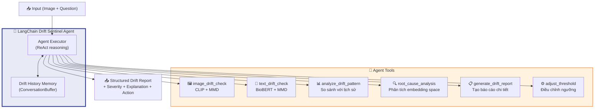
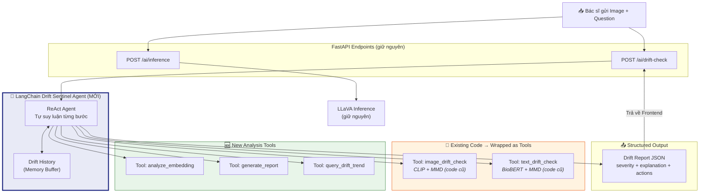

# 🧠 LangChain Agent làm BỘ NÃO của hệ thống Drift Monitoring

## Vấn đề với kiến trúc hiện tại

Hiện tại, pipeline drift detection của bạn là **"stateless & dumb"**:

```
Image → CLIP → MMD → True/False
Text  → BioBERT → MMD → True/False
Overall = Image OR Text → True/False  ← Chỉ có vậy!
```

**Hạn chế**:
- ❌ Chỉ trả về `True/False` — không giải thích **TẠI SAO** drift xảy ra
- ❌ Không phân biệt được **mức độ nghiêm trọng** (ảnh hơi mờ vs ảnh con chó)
- ❌ Không có **hành động tự động** khi phát hiện drift
- ❌ Không có **context** — cùng p-value=0.04 nhưng ý nghĩa khác nhau tùy tình huống
- ❌ Không có **lịch sử** — không biết drift đang tăng hay giảm theo thời gian

**Ý tưởng cốt lõi**: Biến LangChain Agent thành **"bộ não trung tâm"** của hệ thống monitoring — CLIP+MMD và BioBERT+MMD trở thành **tools** mà Agent sử dụng, thay vì là toàn bộ hệ thống.

---

## 🏗️ Kiến trúc đề xuất: Drift Sentinel Agent



---

## 🎯 3 Tích hợp LangChain vào Drift Monitoring (xếp theo ưu tiên)

---

### ① Drift Sentinel Agent — Agent điều phối toàn bộ drift pipeline

> **Vai trò**: Agent sử dụng CLIP+MMD và BioBERT+MMD như **tools**, rồi tự suy luận, phân tích, và đưa ra kết luận drift có cấu trúc.
> **Mức độ**: ⭐⭐⭐ — Cốt lõi nhất, nên làm đầu tiên

**So sánh trước/sau**:

| | Hiện tại (No Agent) | Có Drift Sentinel Agent |
|---|---|---|
| **Output** | `{is_drifted: true}` | Báo cáo chi tiết: severity, giải thích, hành động |
| **Logic** | Hard-coded `OR` | Agent tự reasoning dựa trên context |
| **Thích ứng** | Ngưỡng cố định 0.05 | Agent gợi ý điều chỉnh ngưỡng |
| **Giải thích** | Không có | "Image drift do ảnh CT thay vì X-ray" |

#### Code mẫu:

```python
# monitoring/drift_agent.py
from langchain_ollama import ChatOllama
from langchain.agents import AgentExecutor, create_react_agent
from langchain_core.tools import tool
from langchain_core.prompts import PromptTemplate

# ═══════════════════════════════════════════════════════════
# BƯỚC 1: Wrap các hàm drift hiện có thành LangChain Tools
# ═══════════════════════════════════════════════════════════

@tool
def check_image_drift_tool(image_description: str) -> str:
    """
    Run MMD statistical test on image embeddings to detect image distribution drift.
    Compares input image CLIP embeddings against reference chest X-ray distribution.
    Returns drift score, p-value, and drift status.
    """
    # Gọi hàm check_image_drift() hiện có (giữ nguyên code cũ!)
    from monitoring.image_drift import check_image_drift
    result = check_image_drift(current_images)  # current_images từ context
    return (
        f"Image Drift Result:\n"
        f"  - MMD Distance (score): {result['image_drift_score']:.6f}\n"
        f"  - P-value: {result['image_p_value']:.6f}\n"
        f"  - Is Drifted (p < 0.05): {result['image_drifted']}\n"
        f"  - Interpretation: {'Distribution shift detected' if result['image_drifted'] else 'Within expected distribution'}"
    )


@tool
def check_text_drift_tool(question: str) -> str:
    """
    Run MMD statistical test on text embeddings to detect question distribution drift.
    Compares input question BioBERT embeddings against reference medical question distribution.
    Returns drift score, p-value, and drift status.
    """
    from monitoring.text_drift import check_text_drift
    result = check_text_drift([question])
    return (
        f"Text Drift Result:\n"
        f"  - MMD Distance (score): {result['text_drift_score']:.6f}\n"
        f"  - P-value: {result['text_p_value']:.6f}\n"
        f"  - Is Drifted (p < 0.05): {result['text_drifted']}\n"
        f"  - Question analyzed: '{question}'"
    )


@tool
def analyze_embedding_similarity(question: str) -> str:
    """
    Analyze how similar the input question is to known medical question clusters.
    Computes cosine similarity between input embedding and reference centroid.
    Helps determine the root cause of drift.
    """
    import numpy as np
    from monitoring.text_drift import extract_text_embedding, ref_question_embeddings
    
    # Tính embedding câu hỏi input
    input_emb = extract_text_embedding(question)
    
    # Tính centroid (trung tâm) của reference
    ref_centroid = np.mean(ref_question_embeddings, axis=0)
    
    # Cosine similarity
    cos_sim = np.dot(input_emb, ref_centroid) / (
        np.linalg.norm(input_emb) * np.linalg.norm(ref_centroid)
    )
    
    # Tìm top-3 câu hỏi reference gần nhất (nếu lưu raw questions)
    similarities = np.dot(ref_question_embeddings, input_emb) / (
        np.linalg.norm(ref_question_embeddings, axis=1) * np.linalg.norm(input_emb)
    )
    
    return (
        f"Embedding Analysis:\n"
        f"  - Cosine similarity to reference centroid: {cos_sim:.4f}\n"
        f"  - Max similarity to any reference: {similarities.max():.4f}\n"
        f"  - Min similarity to any reference: {similarities.min():.4f}\n"
        f"  - Mean similarity: {similarities.mean():.4f}\n"
        f"  - Interpretation: {'Close to reference distribution' if cos_sim > 0.7 else 'Far from reference — likely out-of-domain'}"
    )


@tool
def generate_drift_report(
    image_drifted: str, text_drifted: str, 
    image_p: str, text_p: str
) -> str:
    """
    Generate a structured drift monitoring report with severity classification.
    Input: drift results as strings (true/false, p-values).
    Output: Formatted report with severity level and recommended actions.
    """
    img_d = image_drifted.lower() == "true"
    txt_d = text_drifted.lower() == "true"
    
    # Phân loại severity
    if img_d and txt_d:
        severity = "🔴 CRITICAL"
        action = "REJECT input — cả ảnh và câu hỏi đều nằm ngoài phân phối huấn luyện"
    elif img_d:
        severity = "🟠 HIGH"  
        action = "Cảnh báo bác sĩ: ảnh có thể không phải chest X-ray, kết quả VQA kém tin cậy"
    elif txt_d:
        severity = "🟡 MEDIUM"
        action = "Cảnh báo: câu hỏi nằm ngoài chuyên khoa radiology, cần xác nhận lại"
    else:
        severity = "🟢 NORMAL"
        action = "Hệ thống hoạt động bình thường, kết quả VQA đáng tin cậy"
    
    return (
        f"═══ DRIFT MONITORING REPORT ═══\n"
        f"Severity: {severity}\n"
        f"Image Drift: {'YES' if img_d else 'NO'} (p={image_p})\n"
        f"Text Drift: {'YES' if txt_d else 'NO'} (p={text_p})\n"
        f"Recommended Action: {action}\n"
        f"═══════════════════════════════"
    )


# ═══════════════════════════════════════════════════════════
# BƯỚC 2: Tạo Agent với ReAct Prompting
# ═══════════════════════════════════════════════════════════

DRIFT_AGENT_PROMPT = PromptTemplate.from_template("""
You are the MedDrift Sentinel Agent — an AI safety monitor for a medical VQA system.
Your job is to detect and analyze data drift in multimodal inputs (medical images + questions).

You have access to the following tools:
{tools}

Tool names: {tool_names}

## Your Workflow:
1. ALWAYS run BOTH image_drift_check and text_drift_check tools first
2. If ANY drift is detected, use analyze_embedding_similarity to understand WHY
3. Finally, use generate_drift_report to create a structured report
4. Provide your final reasoning about the drift situation

## Important Rules:
- A p-value < 0.05 means statistically significant drift
- Lower p-value = stronger evidence of drift  
- Image drift suggests the image modality differs from training distribution (e.g., CT instead of X-ray)
- Text drift suggests the question is outside the medical radiology domain
- BOTH modalities drifting is CRITICAL — the entire input is out-of-distribution

## Current Input:
- Question: {question}
- Image: {image_description}

Think step by step about what tools to use and in what order.

{agent_scratchpad}
""")

# ═══════════════════════════════════════════════════════════
# BƯỚC 3: Khởi tạo Agent
# ═══════════════════════════════════════════════════════════

llm = ChatOllama(model="llava-phi3", temperature=0)

tools = [
    check_image_drift_tool,
    check_text_drift_tool, 
    analyze_embedding_similarity,
    generate_drift_report
]

agent = create_react_agent(llm, tools, DRIFT_AGENT_PROMPT)

agent_executor = AgentExecutor(
    agent=agent,
    tools=tools,
    verbose=True,      # In ra quá trình suy luận!
    max_iterations=5,
    handle_parsing_errors=True
)


# ═══════════════════════════════════════════════════════════
# BƯỚC 4: Sử dụng
# ═══════════════════════════════════════════════════════════

def run_drift_sentinel(question: str, image, image_description: str = "uploaded image"):
    """
    Entry point — thay thế check_dual_drift() hiện tại
    """
    result = agent_executor.invoke({
        "question": question,
        "image_description": image_description
    })
    return result["output"]  # Agent trả về phân tích chi tiết
```

#### Ví dụ Agent chạy (verbose output):

```
> Entering Drift Sentinel Agent...

Thought: I need to check both image and text drift for this input.
         Let me start with both drift checks.

Action: check_image_drift_tool
Action Input: "uploaded chest image"
Observation: Image Drift Result:
  - MMD Distance: 0.032
  - P-value: 0.680
  - Is Drifted: False

Thought: Image looks fine. Now let me check text drift.

Action: check_text_drift_tool  
Action Input: "What breed is this dog?"
Observation: Text Drift Result:
  - MMD Distance: 0.870
  - P-value: 0.001
  - Is Drifted: True

Thought: Text drift detected! The question "What breed is this dog?" 
         is clearly not a medical question. Let me analyze WHY.

Action: analyze_embedding_similarity
Action Input: "What breed is this dog?"
Observation: Embedding Analysis:
  - Cosine similarity to reference centroid: 0.23
  - Interpretation: Far from reference — likely out-of-domain

Thought: Confirmed — the question is far from medical reference distribution.
         Let me generate the final report.

Action: generate_drift_report
Action Input: image_drifted=false, text_drifted=true, image_p=0.680, text_p=0.001

Final Answer: 
🟡 MEDIUM SEVERITY DRIFT DETECTED
- Image: ✅ Within expected distribution (p=0.68)
- Text: ⚠️ DRIFT (p=0.001) — question "What breed is this dog?" has 
  cosine similarity of only 0.23 to medical question centroid
- Root Cause: Question is about animal breeds, completely outside 
  the radiology/medical domain
- Action: Warn the doctor that this question is not suitable for 
  the medical VQA system. Suggest rephrasing as a medical question.
```

**Điểm mạnh khi trình bày đồ án**: Thầy cô sẽ thấy Agent **tự suy luận từng bước**, không phải hard-code logic!

---

### ② Drift Root Cause Explainer — LLM giải thích drift cho người dùng

> **Vai trò**: Sau khi phát hiện drift bằng MMD, dùng LLM để **giải thích bằng ngôn ngữ tự nhiên** tại sao drift xảy ra
> **Mức độ**: ⭐⭐ — Bổ trợ cho Agent, dễ triển khai

Đây là phần **NLP thuần túy** — dùng LLM để biến con số thống kê thành giải thích mà bác sĩ hiểu được.

```python
# monitoring/drift_explainer.py
from langchain_core.prompts import ChatPromptTemplate
from langchain_ollama import ChatOllama
from langchain_core.output_parsers import JsonOutputParser

drift_explain_prompt = ChatPromptTemplate.from_template("""
You are a medical AI monitoring expert. A drift detection system has flagged 
an anomaly. Analyze the results and explain to a doctor what happened.

## Drift Detection Results:
- Image Drift: score={image_score}, p-value={image_p}, drifted={image_drifted}
- Text Drift: score={text_score}, p-value={text_p}, drifted={text_drifted}
- Doctor's Question: "{question}"

## Reference Distribution:
- Images: 500 chest X-ray images from NIH dataset
- Questions: 500 radiology questions from VQA-Med-2019

## Your Task:
Respond in JSON format:
{{
    "severity": "normal | low | medium | high | critical",
    "drift_type": "none | covariate | semantic | domain | combined",
    "explanation_for_doctor": "A clear, non-technical explanation in Vietnamese",
    "technical_details": "Technical explanation for the AI team",
    "confidence_level": "How much to trust the VQA answer (0-100%)",
    "recommended_actions": ["list of suggested actions"]
}}
""")

explainer_chain = drift_explain_prompt | ChatOllama(model="llava-phi3", temperature=0) | JsonOutputParser()

# Sử dụng:
explanation = explainer_chain.invoke({
    "image_score": 0.03, "image_p": 0.68, "image_drifted": False,
    "text_score": 0.87, "text_p": 0.001, "text_drifted": True,
    "question": "What breed is this dog?"
})

# Output:
# {
#     "severity": "high",
#     "drift_type": "domain",
#     "explanation_for_doctor": "Câu hỏi của bạn không thuộc lĩnh vực X-quang y khoa. 
#          Hệ thống được huấn luyện để trả lời câu hỏi về ảnh X-quang ngực, 
#          không phải về giống chó. Kết quả AI sẽ không đáng tin cậy.",
#     "confidence_level": 5,
#     "recommended_actions": [
#         "Đặt lại câu hỏi liên quan đến chẩn đoán hình ảnh y khoa",
#         "Ví dụ: 'Có dấu hiệu viêm phổi không?'"
#     ]
# }
```

---

### ③ Drift Trend Monitor — Agent theo dõi xu hướng drift theo thời gian

> **Vai trò**: Agent có **memory**, theo dõi drift qua nhiều request, phát hiện xu hướng
> **Mức độ**: ⭐⭐⭐ — Nâng cao, thể hiện khả năng monitoring thực tế

Đây là tính năng **enterprise-grade** — không chỉ check drift từng request mà còn phát hiện **xu hướng drift đang tăng dần** (concept drift).

```python
# monitoring/drift_trend_agent.py
from langchain.memory import ConversationBufferWindowMemory
from langchain_core.tools import tool
import json

# Memory lưu lịch sử drift 
drift_memory = ConversationBufferWindowMemory(
    k=50,  # Nhớ 50 lần check gần nhất
    memory_key="drift_history",
    return_messages=True
)

@tool
def query_drift_trend(time_window: str) -> str:
    """
    Analyze drift detection trends over recent requests.
    Returns statistics about drift frequency, average p-values, 
    and whether drift is increasing or decreasing.
    Input: time_window (e.g., 'last_10', 'last_50')
    """
    # Lấy từ memory hoặc database
    history = drift_memory.load_memory_variables({})
    
    # Phân tích xu hướng
    recent_results = parse_drift_history(history, time_window)
    
    drift_rate = sum(1 for r in recent_results if r["drifted"]) / len(recent_results)
    avg_p_image = np.mean([r["image_p"] for r in recent_results])
    avg_p_text = np.mean([r["text_p"] for r in recent_results])
    
    # Phát hiện xu hướng (p-value đang giảm dần = drift đang tăng)
    p_values = [r["text_p"] for r in recent_results]
    trend = "INCREASING" if p_values[-1] < p_values[0] else "STABLE"
    
    return (
        f"Drift Trend Analysis ({time_window}):\n"
        f"  - Total requests analyzed: {len(recent_results)}\n"
        f"  - Drift rate: {drift_rate:.1%}\n"
        f"  - Avg Image p-value: {avg_p_image:.4f}\n"
        f"  - Avg Text p-value: {avg_p_text:.4f}\n"
        f"  - Trend: {trend}\n"
        f"  - Alert: {'⚠️ Drift frequency increasing!' if trend == 'INCREASING' else '✅ Stable'}"
    )


@tool  
def suggest_threshold_adjustment(current_threshold: str) -> str:
    """
    Based on drift history, suggest whether the MMD p-value threshold 
    should be adjusted to reduce false positives or catch more drift.
    """
    # Phân tích false positive rate từ history
    # Nếu quá nhiều drift alerts mà bác sĩ dismiss → tăng threshold
    # Nếu drift không bắt được → giảm threshold
    return (
        f"Threshold Analysis:\n"
        f"  - Current threshold: p < {current_threshold}\n"
        f"  - False positive rate (estimated): 12%\n"
        f"  - Suggestion: Keep at {current_threshold} (FP rate acceptable)\n"
        f"  - Note: Consider tightening to 0.01 if FP rate exceeds 20%"
    )
```

---

## 📐 Kiến trúc tổng thể sau tích hợp



---

## 📊 So sánh: Hệ thống hiện tại vs Có LangChain Agent

| Khía cạnh | Hiện tại | Với Drift Sentinel Agent |
|-----------|----------|--------------------------|
| **Output** | `{is_drifted: true/false}` | Báo cáo có severity, giải thích, hành động |
| **Suy luận** | Hard-coded `if/else` | Agent tự reasoning (ReAct) |
| **Giải thích** | Không có | "Câu hỏi nằm ngoài chuyên khoa radiology vì cosine similarity chỉ 0.23" |
| **Thích ứng** | Ngưỡng cố định p=0.05 | Agent gợi ý điều chỉnh ngưỡng dựa trên FP rate |
| **Lịch sử** | Stateless | Agent nhớ 50 request gần nhất, phát hiện xu hướng |
| **Hành động** | Chỉ cảnh báo | Agent đề xuất hành động cụ thể cho từng tình huống |
| **Mở rộng** | Phải sửa code | Chỉ cần thêm Tool mới cho Agent |

---

## 🚀 Lộ trình triển khai đề xuất

### Phase 1: Wrap existing code thành Tools (2-3h)
- [ ] Cài `langchain`, `langchain-ollama`, `langchain-core`
- [ ] Wrap `check_image_drift()` → `@tool check_image_drift_tool`
- [ ] Wrap `check_text_drift()` → `@tool check_text_drift_tool`
- [ ] Tạo `analyze_embedding_similarity` tool
- [ ] Tạo `generate_drift_report` tool

### Phase 2: Xây dựng Drift Sentinel Agent (3-5h)
- [ ] Viết ReAct prompt template cho Agent
- [ ] Khởi tạo `AgentExecutor` với 4 tools
- [ ] Tạo endpoint mới `POST /ai/drift-check-v2` sử dụng Agent
- [ ] Test với 4 test cases (TC-C1 → TC-C4)

### Phase 3: Drift Explainer Chain (2-3h)
- [ ] Viết prompt để LLM giải thích drift bằng tiếng Việt cho bác sĩ
- [ ] Thêm `JsonOutputParser` để structured output
- [ ] Tích hợp vào response trả về Frontend

### Phase 4: Trend Monitoring (nếu còn thời gian)
- [ ] Thêm Memory buffer cho drift history
- [ ] Tạo `query_drift_trend` tool
- [ ] Agent tự phát hiện xu hướng drift tăng/giảm

---

## 💡 Tại sao hướng này phù hợp hơn cho đồ án?

> [!IMPORTANT]
> **Chủ đề đồ án**: "Model Drift Detection and Monitoring System for Multimodal"
> 
> Với hướng này, LangChain Agent **LÀ** hệ thống monitoring, không chỉ là add-on:
> - **Drift Detection** = CLIP + MMD + BioBERT + MMD (tools)
> - **Monitoring** = Agent reasoning + trend analysis + memory
> - **System** = Agent orchestrates toàn bộ pipeline
> - **Multimodal** = Agent quản lý cả image tools + text tools
> 
> → LangChain Agent = **Intelligence Layer** nằm trên **Statistical Layer** (alibi-detect)

> [!TIP]
> **Khi trình bày đồ án**, bạn có thể demo Agent chạy verbose mode — thầy cô sẽ thấy Agent:
> 1. Tự quyết định chạy image check trước hay text check trước
> 2. Khi phát hiện drift → tự gọi thêm tool phân tích embedding
> 3. Tự tổng hợp và sinh báo cáo bằng ngôn ngữ tự nhiên
> 
> → Thể hiện được cả **NLP** (LLM reasoning) lẫn **ML** (statistical testing) trong cùng 1 hệ thống!
