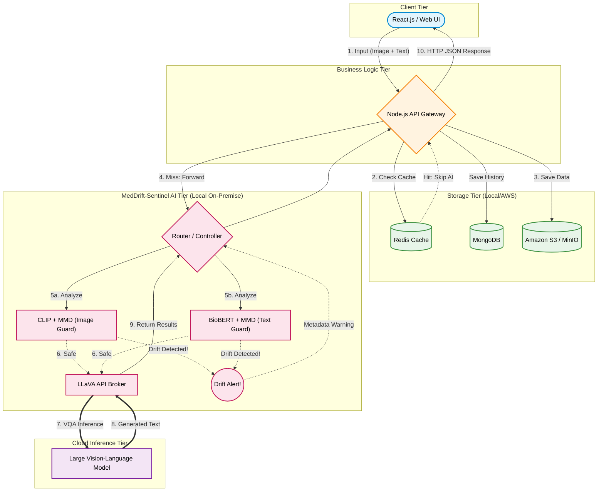

# System Architecture (Kiến trúc Hệ thống)

Hệ thống MedDrift-Sentinel vận hành theo mô hình **Microservices 4-Tier**, giao tiếp qua chuẩn REST API. Toàn bộ hệ thống được container hóa chuyên nghiệp bằng **Docker Compose** để dễ dàng triển khai (deploy) linh hoạt từ môi trường Local cho đến Cloud.

## 1. Mô tả các Tier

### 1.1 Client Tier (React.js)
Giao diện web hiện đại, cho phép bác sĩ:
- Tải ảnh X-quang lên hệ thống (hỗ trợ DICOM, PNG, JPG).
- Đặt câu hỏi y khoa (Medical VQA).
- Xem kết quả trả lời kèm cảnh báo Drift bằng các biểu đồ trực quan.
- Xem lịch sử hỏi đáp trước đó.
- Nhận kết quả chẩn đoán VQA kèm báo cáo Drift chi tiết qua HTTP Response tĩnh.

### 1.2 Business Logic Tier (Node.js / Express) — Orchestrator
Đóng vai trò **trung tâm điều phối** (Orchestrator), chịu trách nhiệm:
- **Authentication & Authorization (Dự kiến)**: Tích hợp xác thực người dùng (JWT), phân quyền truy cập theo vai trò (bác sĩ, admin). Hiện tại MVP tập trung vào luồng xử lý AI.
- **Request Validation**: Kiểm tra định dạng ảnh, kích thước file, nội dung câu hỏi trước khi forward sang AI Service.
- **Caching Layer**: Sử dụng Redis để cache kết quả VQA (cùng ảnh + cùng câu hỏi → trả cache, giảm chi phí gọi API LLaVA-Med). TTL cache: 24 giờ.
- **Orchestration**: Gọi **song song** (Promise.all) hai endpoint của Python AI Service (Drift Check + Inference) và aggregate kết quả.
- **Logging & Audit Trail**: Ghi log mọi request/response (structured JSON logs) phục vụ truy vết và audit.
- **REST API Flow**: Điều phối luồng request HTTP từ React. Quản trị timeout khắt khe (vì inference của LLaVA-Med lên Cloud có thể kéo dài 5–15s).
- **Rate Limiting**: Giới hạn số request/phút để tránh lạm dụng API.

### 1.3 AI Tier (Python / FastAPI)
Chỉ tập trung vào các tác vụ AI nặng, bao gồm hai service con:
- **Drift Service** (`monitoring/`): Thực hiện **Dual Drift Detection** trên cả image và text:
  - **Image Drift**: Trích xuất feature bằng CLIP ViT-B/32 (chạy nhẹ trên CPU/MX450, ~100ms/image), so sánh với tập reference image embeddings bằng alibi-detect (MMD Two-Sample Test).
  - **Text Drift**: Trích xuất feature câu hỏi bằng BioBERT (`dmis-lab/biobert-base-cased-v1.1`), so sánh với tập reference question embeddings bằng alibi-detect MMD Test.
  - **Kết quả tổng hợp**: `overall_drifted = image_drifted OR text_drifted`, kèm `drift_source` cho biết nguồn drift.
- **Inference Gateway** (`inference/`): Forward request sang API LLaVA-Med bên ngoài (Cloud) để lấy câu trả lời y khoa. Hỗ trợ retry (tối đa 3 lần) và timeout (30s).

### 1.4 Storage Tier
- **MongoDB**: Lưu trữ lịch sử hỏi đáp, kết quả drift detection, thông tin user, audit logs.
- **Amazon S3 / MinIO**: Kho Object Storage theo tiêu chuẩn doanh nghiệp để lưu ảnh X-quang khối lượng lớn, có mã hóa at-rest (AES-256).
- **Redis**: Cache kết quả VQA để giảm latency và chi phí API external.

---

## 2. FOLDER STRUCTURE

```
meddrift-vqa-root/
├── meddrift-frontend/            # React.js App
│   ├── src/
│   │   ├── components/           # Upload ảnh, Chat window, Drift Dashboard, History
│   │   ├── hooks/                # API calls & WebSocket hooks to Node.js
│   │   ├── utils/                # Input validators (file type, size)
│   │   └── App.js
│   └── package.json
├── meddrift-server/              # Node.js (Express) - Business Logic
│   ├── src/
│   │   ├── controllers/          # Điều phối logic hỏi đáp và monitoring
│   │   ├── routes/               # API Endpoints cho Frontend
│   │   ├── middleware/           # Auth (JWT), Rate Limiter, Input Validation
│   │   ├── services/             # Gọi sang Python Service & External APIs
│   │   ├── cache/                # Redis cache logic
│   │   └── websocket/            # WebSocket handler cho streaming
│   └── package.json
├── meddrift-ai-service/          # Python (FastAPI) - AI Logic
│   ├── src/
│   │   ├── monitoring/           # alibi-detect implementation (MMD test)
│   │   ├── inference/            # Logic gọi Cloud API (LLaVA-Med) + retry
│   │   ├── validation/           # Validate ảnh input (format, dimensions, is_medical)
│   │   └── main.py               # FastAPI entry point + health check
│   ├── scripts/
│   │   └── build_reference.py    # Script tạo/cập nhật reference embeddings
│   ├── requirements.txt
│   └── Dockerfile
├── configs/                      # File cấu hình chung
│   ├── drift_thresholds.yaml     # Ngưỡng p-value cho MMD (default: 0.05)
│   ├── cache_config.yaml         # TTL, max size cho Redis cache
│   └── environment.env           # Biến môi trường & API Keys
├── data/                         # Scripts quản lý dữ liệu
│   └── reference_data/           # Embeddings mẫu (xem mục 4)
│       ├── ref_images.npy        # CLIP embeddings ảnh (~500 samples, 512-dim)
│       ├── ref_questions.npy     # BioBERT embeddings câu hỏi (~500 samples, 768-dim)
│       └── metadata.json         # Thông tin dataset, ngày tạo, số samples
├── docker-compose.yml            # Kết nối React, Node.js, Python, MongoDB, Redis, MinIO
└── README.md                     # Hướng dẫn cài đặt & vận hành
```

---

## 3. DATA FLOW

### Enterprise MLOps Architecture Diagram



### 3.1 Main Flow (Happy Path)

1. **React → Node.js**: Bác sĩ upload Image + Question qua REST API (`POST /api/vqa`).
2. **Node.js (Validation)**: Validate định dạng ảnh (DICOM/PNG/JPG, ≤10MB) và kiểm tra câu hỏi không rỗng. (Flow check JWT được đưa vào mục dự kiến).
3. **Node.js (Cache Check)**: Hash(image + question) → kiểm tra Redis cache.
   - **Cache Hit**: Trả kết quả ngay, skip bước 4–6.
   - **Cache Miss**: Tiếp tục bước 4.
4. **Node.js (Storage)**: Lưu ảnh vào MinIO (mã hóa AES-256), tạo record lịch sử trong MongoDB.
5. **Node.js (Orchestrate)**: Gửi request **đồng thời** (Promise.all) sang Python AI Service:
   - `POST /ai/drift-check` → Drift Service
   - `POST /ai/inference` → Inference Gateway
6. **Python AI Service**:
   - **Image Drift Check**: CLIP trích xuất image embedding → Load reference image embeddings → alibi-detect MMD Test → `{image_drift_score, image_p_value, image_drifted}`.
   - **Text Drift Check**: BioBERT trích xuất question embedding → Load reference question embeddings → alibi-detect MMD Test → `{text_drift_score, text_p_value, text_drifted}`.
   - **Inference**: Forward sang LLaVA-Med Cloud API → nhận câu trả lời → trả `{answer, confidence}`.
7. **Python → Node.js**: Trả về:
   ```json
   {
     "answer": "...",
     "confidence": 0.85,
     "image_drift": {"score": 0.03, "p_value": 0.72, "is_drifted": false},
     "text_drift": {"score": 0.87, "p_value": 0.001, "is_drifted": true},
     "overall_drifted": true,
     "drift_source": "text"
   }
   ```
8. **Node.js (Post-process)**: Lưu kết quả vào MongoDB, cache vào Redis (TTL 24h).
9. **Node.js → React (HTTP Response)**: Trả về gói dữ liệu JSON hoàn chỉnh cho client. Nếu `is_drifted: true`, React hiển thị cảnh báo đỏ và Agent gợi ý bác sĩ tra cứu thêm trên PubMed.

### 3.2 Error Handling & Fallback

| Lỗi | Xử lý |
|------|--------|
| **LLaVA-Med API timeout (>30s)** | Retry tối đa 3 lần (exponential backoff: 2s, 4s, 8s). Nếu vẫn fail → trả `{answer: null, error: "SERVICE_UNAVAILABLE"}`, React hiển thị: "Hệ thống tạm thời quá tải, vui lòng thử lại sau." |
| **LLaVA-Med API trả lỗi (4xx/5xx)** | Log lỗi chi tiết → trả error code cho Frontend → React hiển thị thông báo lỗi thân thiện. |
| **CLIP extraction fail** (ảnh corrupt, format không hỗ trợ) | Validate ảnh ở bước 2 (Node.js) VÀ bước 6 (Python). Nếu fail → trả `{error: "INVALID_IMAGE"}`, React yêu cầu upload lại. |
| **Drift Detection fail** | Vẫn trả `{answer}` bình thường nhưng kèm `{drift_score: null, is_drifted: null, warning: "DRIFT_CHECK_UNAVAILABLE"}`. React hiển thị kết quả kèm note "Không thể kiểm tra Drift lúc này". |
| **MongoDB/MinIO down** | Node.js trả `503 Service Unavailable`. React hiển thị maintenance page. Hệ thống ghi log vào file local để không mất dữ liệu. |
| **Redis down** | Fallback: bỏ qua cache, gọi trực tiếp sang AI Service (performance giảm nhưng vẫn hoạt động). |

### 3.3 Flow xem Lịch sử

1. **React → Node.js**: `GET /api/history?user_id=xxx&page=1&limit=20`
2. **Node.js**: Query MongoDB, trả về danh sách `{question, answer, drift_score, is_drifted, image_url, created_at}`.
3. **React**: Hiển thị timeline lịch sử hỏi đáp, bác sĩ có thể click vào từng record để xem chi tiết.

---

## 4. REFERENCE DATA MANAGEMENT

### 4.1 Nguồn dữ liệu
Reference embeddings được tạo từ **2 datasets chuẩn**:
- **NIH Chest X-ray**: ~500 ảnh X-ray ngực (public, không cần ký DUA).
- **VQA-Med-2019**: ~500 cặp image-question từ ImageCLEF.

### 4.2 Quy trình tạo Reference Embeddings (Dual)
```
[Image Pipeline]
Raw Medical Images → CLIP ViT-B/32 → Image Vectors (512-dim) → ref_images.npy

[Text Pipeline]
Medical Questions → BioBERT tokenize → CLS embedding (768-dim) → ref_questions.npy
```
- Script: `meddrift-ai-service/scripts/build_reference.py`
- Output: `data/reference_data/ref_images.npy`, `ref_questions.npy`
- Metadata: `data/reference_data/metadata.json` ghi lại ngày tạo, số samples, model versions.

### 4.3 Cập nhật Reference Data
- **Khi nào cập nhật**: Khi thêm dataset mới, hoặc khi phát hiện tỉ lệ false positive drift quá cao (>20%).
- **Quy trình**: Chạy lại `build_reference.py` → replace file `.npy` → restart AI Service (hoặc hot-reload qua API endpoint `POST /ai/reload-reference`).

### 4.4 Kích thước & Performance
- ~500 reference samples cho mỗi modality.
- Image embedding: 512-dim × float32 = ~2KB/sample → tổng ~1MB.
- Text embedding: 768-dim × float32 = ~3KB/sample → tổng ~1.5MB.
- Tổng reference data: ~2.5MB → load vào RAM khi startup, không ảnh hưởng performance.
- MMD test: ~50ms/modality trên CPU.

---

## 5. SECURITY & PRIVACY

### 5.1 Bảo mật dữ liệu y tế
Ảnh X-quang là **dữ liệu y tế nhạy cảm** (thuộc phạm vi quy định bảo mật thông tin y tế). Hệ thống áp dụng các biện pháp:

| Biện pháp | Chi tiết |
|-----------|----------|
| **Mã hóa at-rest** | Ảnh lưu trong MinIO được mã hóa AES-256. |
| **Mã hóa in-transit** | Mọi API call giữa các service sử dụng HTTPS/TLS. |
| **Access Control** | **(Dự kiến)** JWT-based authentication. Phân quyền hiển thị lịch sử khám theo session bác sĩ. |
| **Audit Trail** | Mọi thao tác (upload, query, view history) được ghi log với timestamp, user_id, action. |
| **Data Retention** | Ảnh y tế được xóa tự động sau 30 ngày (configurable). Lịch sử text giữ lại 90 ngày. |
| **Anonymization** | Metadata DICOM (tên bệnh nhân, ngày sinh) được strip trước khi lưu trữ. |

### 5.2 API Security
- **Rate Limiting**: 60 requests/phút/user (chống abuse).
- **Input Sanitization**: Chống XSS, SQL Injection tại Node.js middleware.
- **CORS**: Chỉ cho phép request từ domain frontend.
- **API Key**: Python AI Service chỉ nhận request có internal API key từ Node.js (không expose ra ngoài).

---

## 6. MONITORING & OBSERVABILITY

### 6.1 Health Check Endpoints
Mỗi service expose endpoint `/health` để Docker Compose và monitoring tool kiểm tra:

| Service | Endpoint | Response |
|---------|----------|----------|
| React (Nginx) | `GET /` | 200 OK |
| Node.js | `GET /health` | `{status: "ok", uptime, db_connected, redis_connected}` |
| Python AI | `GET /health` | `{status: "ok", clip_loaded, reference_loaded, gpu_available}` |
| MongoDB | Docker healthcheck | `mongosh --eval "db.runCommand('ping')"` |
| Redis | Docker healthcheck | `redis-cli ping` |

### 6.2 Logging
- **Format**: Structured JSON logs (timestamp, level, service, message, request_id).
- **Centralized**: Tất cả logs ghi vào Docker volumes, có thể tích hợp ELK Stack (Elasticsearch + Logstash + Kibana) cho production.
- **Request Tracing**: Mỗi request từ React được gắn `request_id` duy nhất, truyền qua tất cả các service để dễ debug.

### 6.3 Metrics (cho báo cáo đồ án)
- Latency trung bình mỗi request (end-to-end).
- Tỉ lệ drift detection (bao nhiêu % ảnh bị đánh dấu drift).
- Số lượng request/ngày.
- Cache hit ratio.
- Thời gian trung bình của Drift Check vs Inference.

---

## 7. DEPLOYMENT (Docker Compose)

```yaml
# docker-compose.yml (tóm tắt)
services:
  frontend:       # React.js → port 3000
  server:         # Node.js/Express → port 5000
  ai-service:     # Python/FastAPI → port 8000
  mongodb:        # MongoDB → port 27017
  redis:          # Redis → port 6379
  minio:          # MinIO → port 9000/9001

volumes:
  mongo-data:
  minio-data:
  reference-data: # Mount ./data/reference_data
```

Khởi chạy toàn bộ hệ thống:
```bash
docker-compose up --build
```

---

## 8. DRIFT SIMULATION & TESTING STRATEGIES

Để kiểm chứng hệ thống Drift Detection hoạt động đúng, cần simulate các kịch bản drift trên **cả Image và Text**.

### 8.1 Thiết lập Reference Baseline

| Thành phần | Nguồn | Số lượng |
|-----------|-------|----------|
| **Reference Images** | NIH Chest X-ray (held-out set) | ~500 ảnh |
| **Reference Questions** | VQA-Med-2019 (training set questions) | ~500 câu hỏi |

### 8.2 Image Drift Simulation

| Test Case | Reference | Test Data | Loại Drift | Kỳ vọng |
|-----------|-----------|-----------|------------|----------|
| **TC-I1**: Baseline (No Drift) | NIH Chest X-ray | NIH Chest X-ray (bộ khác) | — | ❌ `image_drifted: false` |
| **TC-I2**: Modality Drift | NIH Chest X-ray | VQA-Med CT/MRI scans | Ảnh từ modality khác | ✅ `image_drifted: true` (drift mạnh) |
| **TC-I3**: Anatomy Drift | NIH Chest X-ray | MURA X-ray tay/đầu gối | Sai vùng cơ thể | ✅ `image_drifted: true` |
| **TC-I4**: Acquisition Drift | NIH Chest X-ray | CheXpert Chest X-ray | Cùng loại, khác scanner/bệnh viện | ⚠️ Drift nhẹ hoặc không |
| **TC-I5**: Garbage Input | NIH Chest X-ray | Ảnh tự nhiên (ImageNet) | Hoàn toàn khác domain | ✅ `image_drifted: true` (drift cực mạnh) |

**Nguồn dataset (tất cả đều public, free):**
- **NIH Chest X-ray**: https://nihcc.app.box.com/v/ChestXray-NIHCC (112K ảnh, không cần DUA)
- **VQA-Med 2019**: https://www.imageclef.org/2019/medical/vqa (~4.2K pairs)
- **MURA**: https://stanfordmlgroup.github.io/competitions/mura/ (X-ray cơ xương khớp)
- **CheXpert**: https://stanfordmlgroup.github.io/competitions/chexpert/ (224K Chest X-ray)

### 8.3 Text Drift Simulation

| Test Case | Reference Questions | Test Question | Loại Drift | Kỳ vọng |
|-----------|-------------------|---------------|------------|----------|
| **TC-T1**: Baseline (No Drift) | VQA-Med questions (radiology) | "Is there any sign of pneumonia?" | — | ❌ `text_drifted: false` |
| **TC-T2**: Semantic Drift | VQA-Med questions (radiology) | "What stage is this melanoma?" (da liễu) | Sai chuyên khoa | ✅ `text_drifted: true` |
| **TC-T3**: Domain Drift | VQA-Med questions (y khoa) | "Is this food fresh?" / "What breed is this dog?" | Không phải y khoa | ✅ `text_drifted: true` (drift mạnh) |
| **TC-T4**: Concept Drift | VQA-Med questions (trước 2020) | "Is this consistent with COVID-19 ground-glass opacity?" | Thuật ngữ/bệnh mới | ⚠️ Có thể drift nhẹ |

**Cách tạo test questions:**
- **TC-T1**: Lấy từ VQA-Med 2019 test set (cùng domain radiology).
- **TC-T2**: Lấy câu hỏi từ PathVQA hoặc tự viết câu hỏi dermatology/ophthalmology.
- **TC-T3**: Lấy câu hỏi từ general VQA datasets (VQAv2, OK-VQA).
- **TC-T4**: Tự viết câu hỏi chứa thuật ngữ y khoa xuất hiện sau 2020 (COVID-19, Long COVID, Monkeypox).

### 8.4 Combined Drift Test Cases

| Test Case | Image | Question | Image Drift? | Text Drift? | Overall | Ý nghĩa |
|-----------|-------|----------|-------------|------------|---------|----------|
| **TC-C1** | Chest X-ray ✅ | Radiology question ✅ | ❌ | ❌ | ❌ Safe | Hoạt động bình thường |
| **TC-C2** | CT scan 🔴 | Radiology question ✅ | ✅ | ❌ | ⚠️ Drift | Ảnh sai modality, câu hỏi đúng |
| **TC-C3** | Chest X-ray ✅ | "What breed is this?" 🔴 | ❌ | ✅ | ⚠️ Drift | Ảnh đúng, câu hỏi sai domain |
| **TC-C4** | Ảnh tự nhiên 🔴 | "Is this food fresh?" 🔴 | ✅ | ✅ | 🔴 Drift | Hoàn toàn sai — reject |

### 8.5 Image Augmentation (Simulate Acquisition Drift)

Để tạo drift nhân tạo với mức độ kiểm soát được:

```python
from torchvision import transforms

# Simulate: máy chụp X-ray khác (contrast, brightness khác)
acquisition_drift = transforms.Compose([
    transforms.ColorJitter(brightness=0.5, contrast=0.5),
    transforms.GaussianBlur(kernel_size=7, sigma=(1.0, 3.0)),
    transforms.RandomAdjustSharpness(sharpness_factor=2.0),
])

# Simulate: góc chụp khác, zoom khác
position_drift = transforms.Compose([
    transforms.RandomRotation(degrees=15),
    transforms.RandomAffine(degrees=0, scale=(0.7, 0.9)),
    transforms.RandomPerspective(distortion_scale=0.3),
])
```

### 8.6 Kết quả mong đợi (cho báo cáo)

Sau khi chạy tất cả test cases, tổng hợp thành bảng:

| Test Case | Image p-value | Text p-value | Image Drift | Text Drift | Overall |
|-----------|--------------|-------------|-------------|------------|----------|
| TC-C1 | >0.05 | >0.05 | ❌ | ❌ | ✅ Safe |
| TC-C2 | <0.001 | >0.05 | ✅ | ❌ | ⚠️ Drift |
| TC-C3 | >0.05 | <0.01 | ❌ | ✅ | ⚠️ Drift |
| TC-C4 | <0.001 | <0.001 | ✅ | ✅ | 🔴 Drift |

→ Bảng này chứng minh hệ thống có khả năng phát hiện drift trên **cả hai modality** một cách độc lập và kết hợp.

### 8.7 Phân cấp mức độ Drift (Drift Severity Simulation)

Để chứng minh thuật toán MMD cảnh báo nhạy bén với sự dịch chuyển từ từ của dữ liệu, hệ thống giả lập Data Drift theo 4 cấp độ (Tăng dần - Progressive Drift).

#### A. Synthetic Text Drift (Sử dụng LLM - VD: Gemini 2.5 Flash)
Dùng LLM để biến đổi câu hỏi gốc thành các mức độ trôi dạt:
*   **Level 0 (No Drift):** Câu hỏi gốc (`"Is there any sign of pneumonia in this X-ray?"`).
*   **Level 1 (Mild Drift):** Thêm từ lóng, viết tắt y khoa, sai ngữ pháp nhẹ (`"r/o pnm cxr?", "signs of lci?"`).
*   **Level 2 (Moderate Drift):** Câu hỏi nghiêng sang chuyên khoa khác nhưng cấu trúc giống y khoa (`"Is this skin lesion malignant?", "Show me the brain tumor"`).
*   **Level 3 (Severe Drift):** Câu hỏi sinh hoạt, đời sống, hoặc nhiễu vô nghĩa (`"What is the weather today?", "Do you like cats?"`).

#### B. Synthetic Image Drift (Sử dụng Image Processing)
Dùng thư viện Python (`Pillow`/`Albumentations`) tác động vật lý lên ảnh X-quang:
*   **Level 0 (No Drift):** Kích thước chuẩn, ảnh gốc từ NIH.
*   **Level 1 (Mild Drift):** 
    *   Tăng giảm sáng/tương phản 15%. 
    *   Xoay (Rotation ±5°). Giải lập thay đổi kỹ thuật viên hoặc thiết bị chiếu chụp.
*   **Level 2 (Moderate Drift):**
    *   Thêm Blur (Gaussian Blur radius 2)
    *   Thêm nhiễu hạt (Gaussian Noise).
    *   Đảo ngược màu (Invert Color - Màng đen sang trắng).
*   **Level 3 (Severe Drift - OOD):**
    *   Đưa hẳn bức ảnh CT/MRI, ảnh siêu âm thai hoặc ảnh thẻ của người thường.
    *   Chèn dòng logo/watermark chữ khổng lồ che lấp toàn bộ phổi.

→ **Mục tiêu Trình bày:** Vẽ biểu đồ PCA (2D) và biểu đồ đường P-value cho thấy khoảng cách giữa tập phân phối (Reference) và tập dữ liệu (Test) nới rộng tương ứng khi Level Drift tăng từ 0 lên 3.
