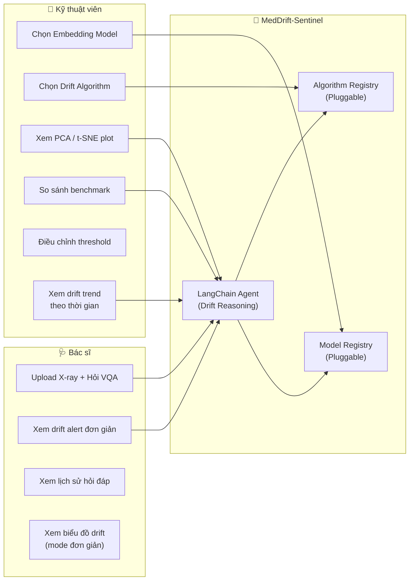

# 🏥 MedDrift-Sentinel — Use Cases & Screen Design

## Tính khả thi: ✅ Hoàn toàn khả thi

Kiến trúc hiện tại đã tách biệt AI Service (Python) và Server (Node.js), nên việc thêm **model registry** và **algorithm registry** chỉ cần mở rộng AI Service — không phá vỡ gì cả.

---

## 👤 Hai nhóm người dùng & nhu cầu

| | 🩺 Bác sĩ / Nhân viên y tế | 🔧 Kỹ thuật viên AI |
|---|---|---|
| **Mục tiêu** | Hỏi đáp VQA, biết kết quả có tin cậy không | Giám sát model health, so sánh thuật toán |
| **Cần xem** | Câu trả lời + cảnh báo drift đơn giản | Biểu đồ phân phối, p-value, so sánh model |
| **Tương tác** | Upload ảnh, đặt câu hỏi, xem lịch sử | Chọn model, chọn thuật toán, xem dashboard |
| **Ngôn ngữ** | Tiếng Việt, phi kỹ thuật | Tiếng Anh kỹ thuật OK |

---

## 📱 5 Màn hình chính

### Screen 1: 💬 Medical VQA Chat (Bác sĩ)
**Mô tả**: Giao diện chat chính, bác sĩ upload ảnh + hỏi câu hỏi

**Tính năng**:
- Upload X-ray (drag & drop hoặc click)
- Nhập câu hỏi y khoa
- Nhận câu trả lời từ AI
- **Drift Alert Badge**: 🟢 Safe / 🟡 Warning / 🔴 Critical hiển thị ngay cạnh câu trả lời
- Khi có drift → hiện tooltip giải thích đơn giản (do LangChain Agent sinh ra)
- Nút "Xem chi tiết drift" → mở panel bên phải hiển thị thông tin thêm

```
┌─────────────────────────────────────────────────┐
│  MedDrift Sentinel          [Dr. Nguyen ▼]      │
├──────────┬──────────────────────────────────────┤
│          │  ┌─────────┐                          │
│ Lịch sử  │  │ X-ray   │  "Có dấu hiệu viêm     │
│ hỏi đáp  │  │ preview │   phổi không?"           │
│          │  └─────────┘                          │
│ • Hôm nay│  ─────────────────────────────────    │
│ • 24/04  │  🤖 AI: "Ảnh cho thấy..." 🟢 Safe    │
│ • 23/04  │                                       │
│          │  ┌─────────┐                          │
│          │  │ Upload ▲│  [Nhập câu hỏi...] [Gửi]│
│          │  └─────────┘                          │
└──────────┴──────────────────────────────────────┘
```

---

### Screen 2: 📊 Drift Dashboard (Bác sĩ + Kỹ thuật viên)
**Mô tả**: Trực quan hóa phân phối dữ liệu và drift

**Cho Bác sĩ** (tab đơn giản):
- Biểu đồ tròn: % request Safe vs Drifted (tuần/tháng)
- Timeline: lịch sử drift alerts
- Đèn tín hiệu tổng thể: 🟢🟡🔴

**Cho Kỹ thuật viên** (tab nâng cao):
- **PCA/t-SNE 2D scatter plot**: Reference embeddings (xanh) vs Input embeddings (đỏ)
- **P-value timeline**: Biểu đồ đường p-value theo thời gian
- **Distribution histogram**: So sánh phân phối embedding distance
- **Drift rate over time**: % drift theo ngày/tuần

```
┌──────────────────────────────────────────────────┐
│  📊 Drift Dashboard     [Simple | Advanced ▼]    │
├──────────────────────────────────────────────────┤
│  ┌──────────────┐  ┌──────────────┐              │
│  │ PCA Plot     │  │ P-value      │              │
│  │ (Image)      │  │ Timeline     │              │
│  │  🔵🔵🔵🔴    │  │  ───╲──────  │              │
│  │  🔵🔵🔴🔴    │  │     threshold│              │
│  └──────────────┘  └──────────────┘              │
│  ┌──────────────┐  ┌──────────────┐              │
│  │ PCA Plot     │  │ Drift Rate   │              │
│  │ (Text)       │  │ Bar Chart    │              │
│  │  🔵🔵🔵      │  │  ▇▇▃▇▅      │              │
│  │  🔵🔴🔴      │  │  M T W T F  │              │
│  └──────────────┘  └──────────────┘              │
└──────────────────────────────────────────────────┘
```

---

### Screen 3: 📜 Chat History (Bác sĩ)
**Mô tả**: Lịch sử hỏi đáp với bộ lọc

**Tính năng**:
- Danh sách các phiên hỏi đáp (ảnh thumbnail + câu hỏi + drift status)
- Filter: theo ngày, theo drift status (All / Safe / Drifted)
- Click vào → xem lại chi tiết câu trả lời + drift report
- Export PDF (cho hồ sơ bệnh án)

---

### Screen 4: ⚙️ Configuration Panel (Kỹ thuật viên)
**Mô tả**: Chọn model embedding + thuật toán drift — **đây là điểm flexible**

**Tính năng**:

#### Chọn Embedding Model:
| Loại | Options | Mô tả |
|------|---------|-------|
| **Image Encoder** | CLIP ViT-B/32, BiomedCLIP, DINOv2 | Trích xuất feature ảnh |
| **Text Encoder** | BioBERT, PubMedBERT, ClinicalBERT | Trích xuất feature câu hỏi |

#### Chọn Drift Algorithm:
| Algorithm | Ưu điểm | Nhược điểm |
|-----------|---------|------------|
| **MMD** (hiện tại) | Mạnh cho high-dimensional | Chậm với dataset lớn |
| **KS Test** | Nhanh, dễ hiểu | Chỉ 1 chiều |
| **LSDD** | Nhạy hơn MMD | Tốn compute hơn |
| **Chi-squared** | Cổ điển, interpretable | Cần discretize |

```
┌──────────────────────────────────────────────────┐
│  ⚙️ Drift Detection Configuration                │
├──────────────────────────────────────────────────┤
│                                                   │
│  🖼️ Image Pipeline:                               │
│  ┌─────────────────┐  ┌─────────────────┐        │
│  │ Encoder Model   │  │ Drift Algorithm │        │
│  │ [CLIP ViT-B/32▼]│  │ [MMD Test    ▼] │        │
│  └─────────────────┘  └─────────────────┘        │
│                                                   │
│  📝 Text Pipeline:                                │
│  ┌─────────────────┐  ┌─────────────────┐        │
│  │ Encoder Model   │  │ Drift Algorithm │        │
│  │ [BioBERT      ▼]│  │ [MMD Test    ▼] │        │
│  └─────────────────┘  └─────────────────┘        │
│                                                   │
│  📏 Thresholds:                                   │
│  P-value threshold: [0.05  ]                      │
│  Reference samples: [500   ]                      │
│                                                   │
│  [💾 Save & Apply]  [🔄 Reset to Default]         │
└──────────────────────────────────────────────────┘
```

---

### Screen 5: 🧪 Benchmark / Compare (Kỹ thuật viên)
**Mô tả**: So sánh hiệu năng giữa các tổ hợp model + algorithm

**Tính năng**:
- Chọn 2-3 tổ hợp (encoder + algorithm) để so sánh
- Chạy trên cùng test dataset → hiển thị bảng so sánh
- Metrics: Accuracy, F1, Latency, False Positive Rate

```
┌──────────────────────────────────────────────────┐
│  🧪 Benchmark Results                             │
├──────────────────────────────────────────────────┤
│  Config A: CLIP + MMD     Config B: BiomedCLIP + LSDD │
│  ┌────────────┬──────────┬──────────┐            │
│  │ Metric     │ Config A │ Config B │            │
│  ├────────────┼──────────┼──────────┤            │
│  │ Accuracy   │ 92%      │ 95%      │            │
│  │ Latency    │ 50ms     │ 120ms    │            │
│  │ FP Rate    │ 8%       │ 3%       │            │
│  └────────────┴──────────┴──────────┘            │
└──────────────────────────────────────────────────┘
```

---

## 🔌 Kiến trúc Flexible (Model & Algorithm Registry)

Để hỗ trợ nhiều model + thuật toán, backend cần **Registry Pattern**:

```python
# monitoring/registry.py — Ý tưởng kiến trúc

# ═══ IMAGE ENCODER REGISTRY ═══
IMAGE_ENCODERS = {
    "clip-vit-b32": {
        "name": "CLIP ViT-B/32",
        "dim": 512,
        "loader": lambda: load_clip_model()
    },
    "biomedclip": {
        "name": "BiomedCLIP",
        "dim": 512,
        "loader": lambda: load_biomedclip_model()
    },
}

# ═══ DRIFT ALGORITHM REGISTRY ═══
DRIFT_ALGORITHMS = {
    "mmd": {
        "name": "MMD Two-Sample Test",
        "class": "alibi_detect.cd.MMDDrift",
        "description": "Kernel-based, good for high-dim"
    },
    "lsdd": {
        "name": "LSDD Test",
        "class": "alibi_detect.cd.LSDDDrift",
        "description": "Density ratio, more sensitive"
    },
    "ks": {
        "name": "Kolmogorov-Smirnov",
        "class": "alibi_detect.cd.KSDrift",
        "description": "Classic, per-feature test"
    },
}

# ═══ API: Liệt kê options cho Frontend ═══
# GET /ai/config/encoders → trả list encoders
# GET /ai/config/algorithms → trả list algorithms
# POST /ai/config/apply → đổi encoder/algorithm runtime
```

---

## 🗺️ Use Case Diagram tổng hợp



---

## 📋 Tóm tắt 5 màn hình

| # | Màn hình | Người dùng | Vai trò LangChain |
|---|----------|-----------|-------------------|
| 1 | **VQA Chat** | Bác sĩ | Agent giải thích drift warning |
| 2 | **Drift Dashboard** | Cả hai | Agent phân tích trend, sinh insight |
| 3 | **Chat History** | Bác sĩ | — |
| 4 | **Configuration** | Kỹ thuật viên | Agent gợi ý config tối ưu |
| 5 | **Benchmark** | Kỹ thuật viên | Agent so sánh & nhận xét kết quả |

> [!TIP]
> **Registry Pattern** giúp mentor đánh giá cao vì thể hiện **software engineering maturity** — hệ thống extensible, không hard-code. Thêm model mới chỉ cần register vào dictionary, không sửa logic.
